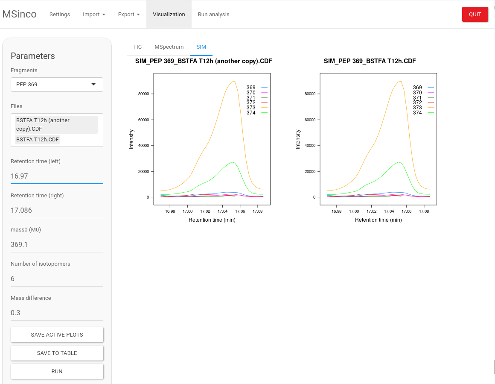
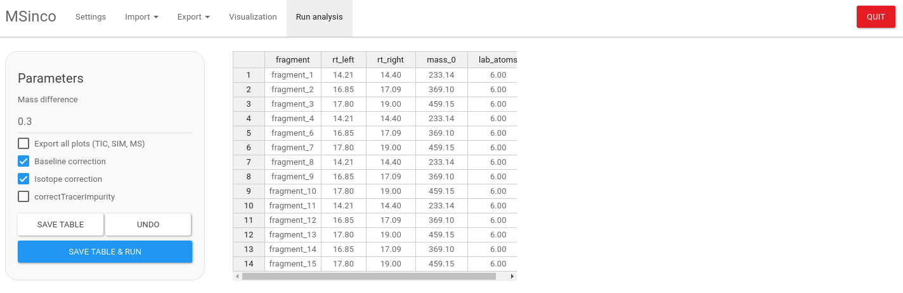

```{r, include = FALSE}
knitr::opts_chunk$set(
  collapse = TRUE,
  comment = "#>",
  fig.path = "man/figures/README-",
  out.width = "100%"
)
```

# MSinco

Mass Spectrometry Integrator and Corrector

{width="1424"}



## Installation

Manually:
1- Download MSinco_0.2.tar.gz ([Releases](https://github.com/mbousq/MSinco/releases))
2- In Rstudio, Install Package --\> Install from Package Archive File (tar.gz)

From github:

if (!requireNamespace("BiocManager", quietly = TRUE))
    install.packages("BiocManager")
    BiocManager::install("MSnbase")
    BiocManager::install("IsoCorrectoR")
    
if (!requireNamespace("devtools", quietly = TRUE))
    install.packages("devtools")
    devtools::install_github("mbousq/MSinco")

## Usage

```{r }

library(MSinco)

MSinco::run_app()
```
