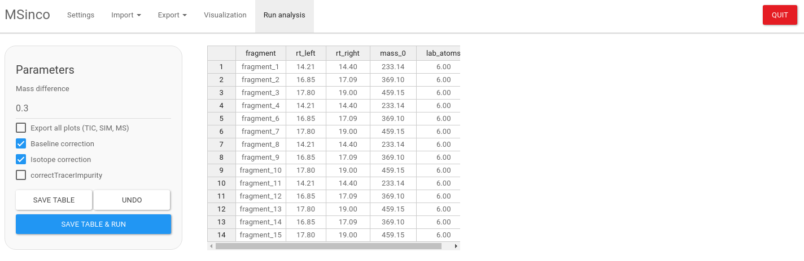

# MSinco

Mass Spectrometry Integrator and Corrector




## Installation

Manually: 1- Download MSinco\_0.2.tar.gz
([Releases](https://github.com/mbousq/MSinco/releases)) 2- In Rstudio,
Install Package –&gt; Install from Package Archive File (tar.gz)

From github:

if (!requireNamespace(“BiocManager”, quietly = TRUE))
install.packages(“BiocManager”) BiocManager::install(“MSnbase”)
BiocManager::install(“IsoCorrectoR”)

if (!requireNamespace(“devtools”, quietly = TRUE))
install.packages(“devtools”) devtools::install\_github(“mbousq/MSinco”)

## Usage

``` r
library(MSinco)
#> Loading required package: data.table
#> Loading required package: lattice

MSinco::run_app()
#> Loading required package: shiny
#> 
#> Listening on http://127.0.0.1:4743
```


